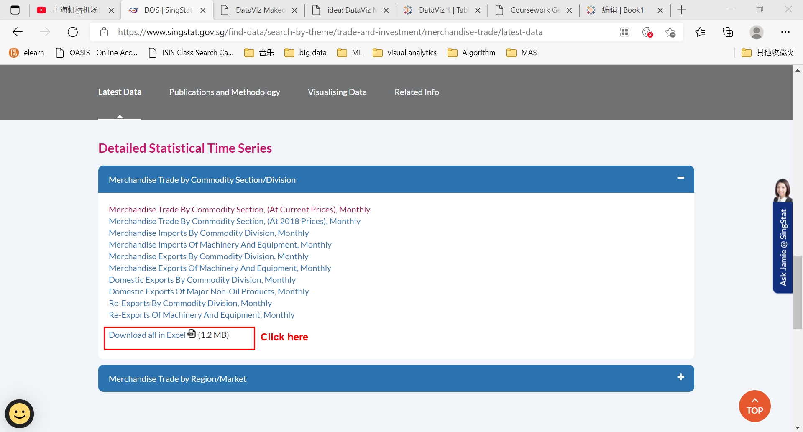

```{r setup, include=FALSE}
knitr::opts_chunk$set(echo = FALSE)
```


## 1.0 Critique of Visualisation
### 1.1 Clarity

a.Confusing graph title: what does it mean by 'Merchandise Trade of Top Six Trading Countries,2019-2020'? Are these 6 countries with the largest import or export trading volume?  It doesn't indicate how the the countries are selected. Moreover, it fails to summarize the whole message author hope to deliver, i.e. without mentioning the export and import comparison  

b.The plot of Japan has the different time scale. Does the author purposefully do it or simply because of the missing data? From the data source,we can find there are quite a few of months trading data missed for Japan. But the author don't clarify this issue,which introduces the loss of data integrity.

c.Misleading unit of Y-axis:The unit is inconsistent within each chart as well as across all of 6 charts. Some are 2M, 1M while others are 200k. In addition, what's the exactly currency unit? is it dollars or the native currency unit,say RMB for China and HK$ for Hong Kong? Without that, the whole chart loses the comparability.

d.No captions(data source quotes), and no lead-in or call-outs to provide context.

e.No reference line or grid: it's hard to evaluate the gap between the export and import height.


### 1.2 Aesthetics
a.The width of charts are not equally set, which looks not neat e.g The chart width for Hong Kong and Malaysia are obviously not same. 

b.The space between each chart are quite wide whereas the chart itself is relatively narrow, which will make readers hard to compare between charts

c.Font size hasn't been tuned properly. The graph title even has smaller font size than the subtitle for individual chart.

d.No tick marks in y-axis.


## 2.0 Alternative of design


### 2.1 Clarity
a. Title and subtitle clearly deliver the summary and context of the whole graph,i.e. What&Why?

b. Reference line has been highlighted as the pre-attentive process for reader's eye i.e. Where?

c. Data source has been provided for reader's further reference i.e.Then?


### 2.2 Aesthetics
a.Chart of each country has been squeezed in one landscape(not two rows as the old one) for the convenience of comparison.

b.Aligned charts width and consistent y-axis unit&scale.

c.Major and minor tick marks have been provided for easier comparison.


## 3.0 Tableau showcase

Please refer it on Tableau Public [link](https://public.tableau.com/app/profile/nian.liu1906/viz/Book1_16223459312690/TradingFluctuationsBeforeandAfterCovid-19Lock-down)

## 4.0 Step-by-step Guide

### 4.1 Data download and import
a.Go to the link [link](https://www.singstat.gov.sg/find-data/search-by-theme/trade-and-investment/merchandise-trade/latest-data) (Department of Statistics Singapore) and scroll down to the bottom,then Click 'Download all in the Excel'

b.Import the outputFile.xlsx to Tableau


### 4.2 Select the targeted 6 countries  
a.Union the T1 and T2 worksheet.

b.Pivot the all the columns at year 2019 and 2020.

c.Rename the 'Pivot Field Names' as '2019-2020 M/Y'. 

Likewise, we can rename the 'Variables' as 'Country', the 'Pivot Field values' as 'Trading values'.
And finally we change the data type of '2019-2020 M/Y' to 'Date'

d.Drag the 'Countries' into the Column of worksheet,and drag the 'Trading values' into Row .

e.Sort it by 'Trading values' in descending order and select the top 6 countries ,then set them as 'keep only'.

The graph will change to below:


### 4.3 visualise the trading fluctuations
a.Create calculated fields for 'Import'

And define the formula of Import

Likewise, define the new field of 'Export' 

b.Once these two new fields have been created, drag and drop them on the Column of worksheet
In the meantime, drag the 'Countries' and '2019-2020 M/Y' sequentially on the Row

Then drill down  the 2029-2020 M/Y as below(since only Year will be extracted from  this field by default):

Lastly set the 'Sum of Import' as Dual axis as below

c.Now Change the mark of both Export and Import into Area type

d.Rename the title and center it

e.Edit the axis of Export


Then click the Import axis to synchronize the setting with Export axis

f.Edit the axis of year

g.Set the reference line of Covid-19
Right click the x-axis:


h.set the caption
Right click the whole graph


## 5.0 Observations
1.The level of pandemic impact on the trading volume, at the onset of Covid-19, varied from country to country. Some countries,like China and Malaysia, responded very sensitively with a sharp drop. While other countries, like US and HK remained very stable.It may be attributed to their different domestic epidemic controlling situations along with the trading policies. 

2.From the total trading volume of perspective, all the 6 countries seems recovered very quickly after the pandemic pandemic. However, there is a twist for Malaysia and US. The relationship between export and import trading size reversed after the breakout of Covid-19, which may due to the dramatic change of domestic product demand and supply. 

3.By compare the gap between the export and import, we may find Taiwan is relatively more demanding on import rather than export, while the Indonesia show the inverted pattern, which may result from their different economic situations. 


