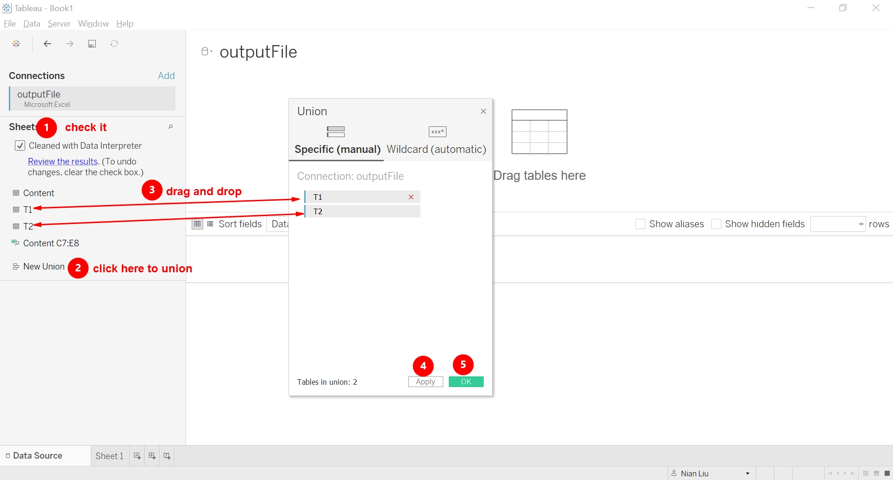

```{r setup, include=FALSE}
knitr::opts_chunk$set(echo = FALSE)
```


## 1.0 Critique of Visualisation
### 1.1 Clarity
**a.No graph title**
Without it, reader cannot quickly understand the context of  whole chart.


**b.No tick marks or  grid line or the explicit indication of Import/Export value**     
With none of them, it would be hard for readers to estimate the exact Import/Export value for one particular country. 


**c.The exclamation caption below the graph is quite confusing**
The statement it provides seems have different standpoint or dimension from the graph, which introduce more ambiguities and also violates the purpose of caption itself


It states that since year of 2006 for US and 2009 for China, the quantity relationship between export and import reversed,  while the info graph shows is the comparison at year of 2020. So the graph does not give us any info during the time in between.  Readers may be confusing about what happened in between but have no access to check more details.

**d. No clarification regarding the currency or calculated unit **
Without it, readers may feel confused.


### 1.2 Aesthetics
**a.No interactivity **:The chart is static, without filter or tooltip. Readers have no chance to catch the pattern  of trading evolution for each trading partner(No time filter), nor can they check the details for one particular country(No country selection).

**b.Label and mark overlapping** :The label and mark of several trading partners overlapping  makes the whole chart looks quite messy, whereby readers cannot easily gauge the relative trading size for one particular entity.


**c.Misleading axis title**: The title of 'Export' and 'Import' are entangled within the bottom left corner, make readers confused if no close attention is taken.


## 2.0 Alternative of design


### 2.1 Clarity

**a.Provide the title as context**

**b.Provide the unit and tick marks**

**c.Give caption for reader knowledge** 
The caption will include the calculation base & currency unit clarification, key insight apart from the data source, which will be more user-friendly.   

**d.Interactivity provide more info and  enlightenment to readers**
By adding the time animation, readers can easily observe the evolution of trading position among the trading partners with Singapore. In addition,by adding the tooltip referring another chart(year trending chart),  it's also accessible for readers to check more details of one specific partner given one specific  year


### 2.2 Aesthetics
**a.Filter and animation** Tooltip(Hovering) can provide the trend line of trading volume for one partner at specific year.

**b.Get rid of the amount**, given that most readers only care about the relative size and the change of trading volume of each partners.Also, the tooltip include the specific value if they really hope to check more details.

**c.Centered axis title**

## 3.0 Tableau showcase


Please refer to [Tableau Public](https://public.tableau.com/app/profile/nian.liu1906/viz/Thetradingvolumeevolutionoftop10partnerswithSingaporeinpast10years/Sheet1)


## 4.0 Step-by-step Guide
### 4.1 Data download and import
a.Go to the link [link](https://www.singstat.gov.sg/find-data/search-by-theme/trade-and-investment/merchandise-trade/latest-data) (Department of Statistics Singapore) and scroll down to the bottom,then Click 'Download all in the Excel'

b.Import the outputFile.xlsx to Tableau


### 4.2 Data preprocessing

a.Union the T1 and T2 worksheet.

b.Hide all the irrelevant columns by selecting them and right click  'Hide'.
Below shows select the date columns from 1976 Jan all the way to 2010 Dec. 

Likewise we can hide the columns from 2021 Jan to 2021 Apr.
Then we pivot the data columns from 2011 Jan to 2020 Dec by select all of them and right click pivot as below:

c.Next we rename the relevant columns as below:

d.One more step  before we finish our data pre-processing is to split the *'Variables'* column by 
separator '(' by right click 'custom split':

Finally we get the below fields in our data pane:


### 4.3 Create calculated fields
a. Create the new field called 'Export'

Then customize the number format of 'Export' by right click it and select the Default
properties->Number format:

Then set it to the Million as Display Unit:


b.Likewise create the field called 'Import' 

Set the number format of it to the Million as Display Unit(same as 'Export')
Also,set the number format of 'Trading value' to the Million as Display Unit(same as 'Export')

c.Create the field called 'reference line' 


d.Finally the data pane look like below:


### 4.4 visualisation

a.Drag the country and Trading value to the column and row shelf respectively  and then sort them in descending order. After that, select the top 10 countries(excluding the Total item ) as below:


b.After screen out these 10 countries, remove all the fields from the row and column shelf.
Then drag the Export and Import to the column and row shelf respectively.Drag the Country as both detail and color,  and Total as the size to the Mark cards.See as below:


c.Next drag the reference line to the row shelf. Then remove all the fields in the mark cards for reference line except the country as the detail.Remember to switch the chart type to line and scale down the size of  line to the minimum. The overall view will be as below:


d.Afterwards, add the trend line to extent the reference line as below:


e.Finally combine the two axis by right click the reference axis and select 'Dual axis'.
The view is as below:


f.Remove the header of reference line axis by right click around the reference line aixs and select 'show the header' :


### 4.5 Add animation
a.Transform the data type of year-month to Data&Time by right click the year-month field in the Data pane
b.Drag the Year-month to the Filter pane.The animation will play once you double click the 'next' or 'previous' icon:


c.Now to illustrate the movement pattern  of trading volume for each partners along the timeline, click on the Format in the menu and set the style to 'Sequential':


### 4.6 Cross referring another chart in tooltip
a.Create a new sheet and drag the fields 'Year-month' to column shelf and the 'Export' and 'Import' to the row shelf as below:


b.Generate the dual axis as below:


c.Synchronize the axis unit of 'Import' with 'Export':


d.Hide the header of 'Import' axis and rename the 'Year-month' header to 'Year', the 'Export' to 'Trading value' as below:


e.Uncheck the 'Include zero' by right click the y-axis and select 'Edit axis':


f.Finally come back to our main sheet and edit the tooltip:

(Take note of the color setting and inserting the sheet name )

### 4.7 Fine-tune the whole chart
a.Edit the chart title as below:

b.Edit the caption as below:


## 5.0 Insights
**(a)**Mainland China transcend Malaysia to be the largest trading partner with Singapore in the past 10 years, no matter with respect to import or export value.

**(b)**Among the other 9 trading partners, US become the fastest growing countries.

**(c)**while US reverse the import value over export recently, Malaysia reverse the export value over the import.

**(d)**Compared with the 3 partners mentioned above, the trading value fluctuation of rest partners  with Singapore kept relatively mild.


